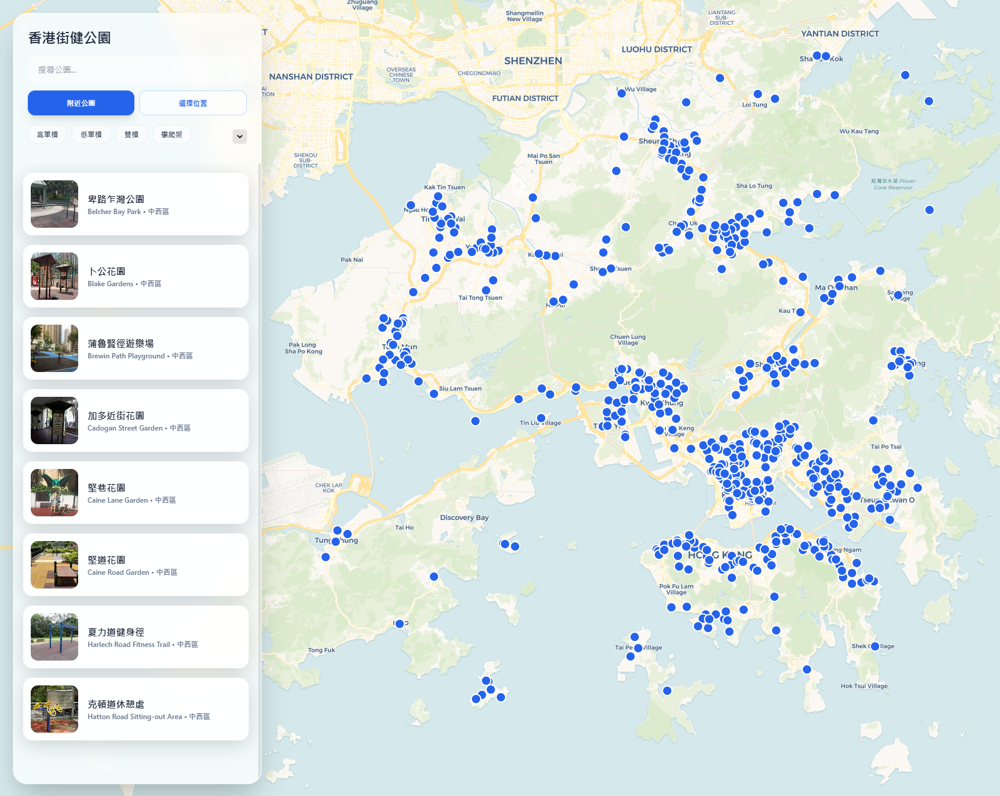

# Hong Kong Park Searcher 香港街健公園搜尋器

係一個幫你搵香港街頭健身公園嘅網頁。如果你想搵附近邊度有單槓、雙槓或者其他健身設施，呢度就啱晒你。

A web application to find street workout parks in Hong Kong.

  

## 提交資料與貢獻 Contribute

我們非常歡迎任何形式的貢獻！無論是提交新公園資料、報告錯誤或改進程式碼。

We welcome all forms of contribution! Whether it's submitting new park data, reporting bugs, or improving the code.

- **網頁投稿 Submit via web form**: [提交公園資料 / Submit park data](https://mc-marcocheng.github.io/hk-park-searcher/contribute.html)
- **Google Form 仍可使用 Google Form is still available**: [香港街健公園資料提交](https://forms.gle/tBqyQ5meYqtdXcja7)
- **貢獻指南 Contributing Guide**: 請參閱 [CONTRIBUTING.md](CONTRIBUTING.md)。
- **開發及部署文件 Developer and deployment docs**: 請參閱 [docs/](https://mc-marcocheng.github.io/hk-park-searcher/docs)。
