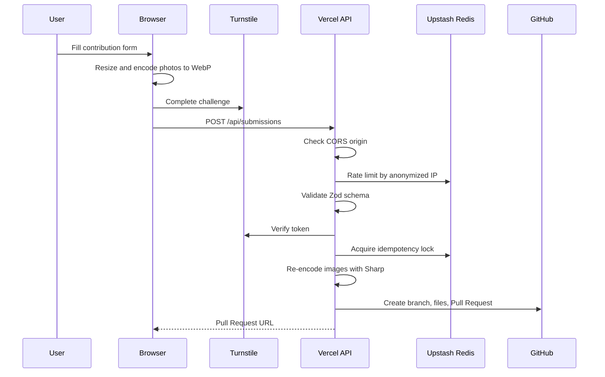
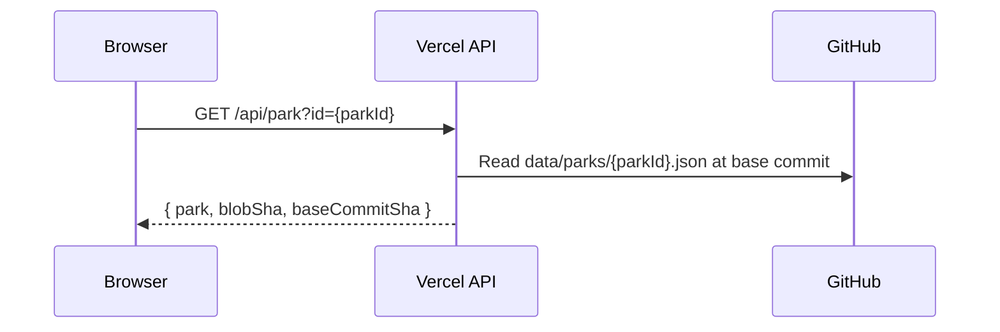
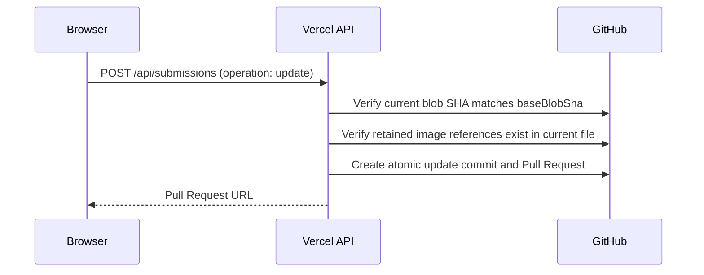

# Contribution system

The contribution system lets non-technical users submit park data through a web
form while keeping maintainers in control through GitHub Pull Request review.

## Public contribution links

Recommended form:

```text
https://mc-marcocheng.github.io/hk-park-searcher/contribute.html
```

Google Form fallback:

```text
https://forms.gle/tBqyQ5meYqtdXcja7
```

## End-to-end flow



## Frontend responsibilities

The contribution page is implemented by:

```text
contribute.html
js/contribution.js
js/contribution-catalog.js
js/contribution-config.js
css/contribution.css
```

It performs:

- Form rendering
- District and equipment catalogue rendering
- Leaflet map coordinate selection
- Browser-side image resizing
- Browser-side WebP encoding
- Basic validation
- Cloudflare Turnstile rendering
- Payload submission to the backend

The frontend config lives in:

```javascript
window.PARK_CONTRIBUTION_CONFIG = Object.freeze({
  apiUrl: "https://hk-park-searcher.vercel.app/api/submissions",
  turnstileSiteKey: "..."
});
```

## Backend responsibilities

The backend endpoint is:

```text
backend/api/submissions.js
```

It performs:

- Origin allow-list check
- CORS headers
- Method check
- Payload size check
- IP-based rate limiting
- JSON parsing
- Zod validation
- Honeypot rejection
- Turnstile verification
- Idempotency lock
- GitHub Pull Request creation

## Submission validation

The main schema lives in:

```text
backend/lib/schema.js
```

Submissions use **version 2** and are a discriminated union on `operation`:

- `create` — adds a new park. Rejects `retainedImages`.
- `update` — improves an existing park. Requires `parkId`, a 40-character
  `baseBlobSha`, and a `retainedImages` array.

Validation includes:

- Submission version (`2`)
- UUID submission key
- Hong Kong coordinate bounds
- District code
- Equipment codes
- Required environment photo
- Required equipment photo for each listed equipment type
- Maximum 8 images
- Maximum combined processed image size
- Required attestations
- Base64 byte length checks
- For `update`: retained image references must exist in the current park file

## Park id and image naming

The backend is **authoritative** for identifiers. The browser must never
propose a park id, filename, or existing-image reference.

- **Park ids** are human-readable slugs derived from the English name, then the
  English address, then a deterministic coordinate fallback
  (`{district}-park-{lat}-{lng}`). Collisions append `-2`, `-3`, etc. Chinese-only
  submissions fall back to the coordinate slug rather than a random id.
- **Image filenames** are semantic: environment photos become `overview_1`,
  `overview_2`, … and equipment photos become `{equipmentType}_1`, … (for
  example `high_pull_up_bar_1`). Client-supplied UUIDs are never persisted.

## Canonical park endpoint

The browser loads the current canonical park before an update via:

```text
GET /api/park?id={parkId}
```

It returns the park record, its current blob SHA, and the base commit SHA. The
blob SHA is sent back as `baseBlobSha` so the backend can detect concurrent
edits (stale-update → `409`).



## Image handling

Images are processed twice:

1. **Browser-side** for better user experience and smaller payloads.
2. **Server-side** with Sharp before committing to the repository.

Server-side image handling lives in:

```text
backend/lib/images.js
```

The backend creates:

```text
assets/images/parks/{parkId}/med/{clientId}.webp
assets/images/parks/{parkId}/thumb/{clientId}.webp
```

## Pull Request output

For each accepted submission, the GitHub App creates a branch like:

```text
contribution/park-YYYYMMDD-xxxxxxxx
```

For a **create** submission the Pull Request contains:

```text
data/parks/{generatedParkId}.json
assets/images/parks/{generatedParkId}/med/*.webp
assets/images/parks/{generatedParkId}/thumb/*.webp
```

For an **update** submission the Pull Request contains the modified park JSON
plus only the added/removed image files (retained images are not re-uploaded):

```text
data/parks/{parkId}.json
assets/images/parks/{parkId}/med/{added}.webp      (new images only)
assets/images/parks/{parkId}/thumb/{added}.webp    (new images only)
assets/images/parks/{parkId}/med/{removed}.webp    (deleted images)
assets/images/parks/{parkId}/thumb/{removed}.webp  (deleted images)
```

The generated park JSON includes:

- Park name
- Coordinates
- District object
- Address
- Equipment entries
- Image references
- Quality rating
- Comment
- Contribution timestamp

## Update mode

Update submissions are applied as a single atomic commit on top of the base
commit the browser loaded. The backend re-reads the park file at `baseBlobSha`
to reject stale edits and to authenticate every retained image reference.



## Review model

Community submissions are public Pull Requests. Maintainers should review:

- Whether the park exists and is public
- Whether coordinates are correct
- Whether the district and address are correct
- Whether photos are appropriate and usable
- Whether equipment labels are accurate
- Whether comments contain private or unsafe content

After approval and merge, rebuild data if needed:

```bash
npm run validate:data
npm run build:data
```
