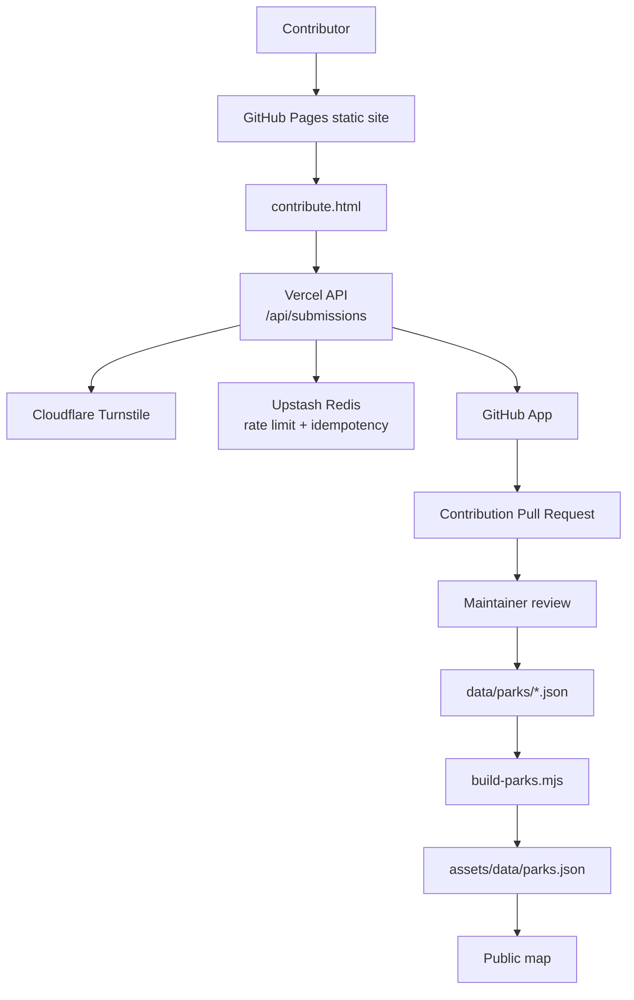

<section class="docs-hero">
  

    
HK calisthenics directory

    <h1>
      Find and improve street workout park data.
    </h1>

    

      Hong Kong Park Searcher is a static map application with a serverless
      contribution backend. Community submissions become public GitHub Pull
      Requests for maintainer review.
    

    

      <a class="docs-button" href="getting-started/">
        Get started →
      </a>

      <a class="docs-button docs-button--secondary" href="contribution-system/">
        Understand submissions
      </a>
    

  

  

    
Contribution flow

    <ol aria-label="Park contribution flow">
      <li>Open the contribution form</li>
      <li>Enter park details and map location</li>
      <li>Process photos in the browser</li>
      <li>Submit to the Vercel backend</li>
      <li>Create a GitHub Pull Request</li>
      <li>Review, merge, and rebuild public data</li>
    </ol>
  

</section>

<section class="docs-section">
  

    
Project overview

    <h2>Main components</h2>
    

      The app is intentionally simple: static frontend files, JSON park data,
      optimized WebP images, and a small serverless backend for community
      submissions.
    

  

  

    <article class="docs-card">
      <h3>Static map frontend</h3>
      

        The public app uses Leaflet, static JSON data, optimized WebP photos,
        search, filters, geolocation, and a responsive UI.
      

      HTML · CSS · Leaflet
    </article>

    <article class="docs-card">
      <h3>Source park data</h3>
      

        Individual park files live in <code>data/parks/</code> and are built
        into <code>assets/data/parks.json</code> for the browser.
      

      JSON · build script
    </article>

    <article class="docs-card">
      <h3>Image workflow</h3>
      

        Raw photos are processed into committed medium and thumbnail WebP
        variants under <code>assets/images/parks/</code>.
      

      Sharp · WebP
    </article>

    <article class="docs-card">
      <h3>Contribution backend</h3>
      

        A Vercel serverless function validates submissions, verifies Turnstile,
        rate limits requests, re-encodes images, and creates Pull Requests.
      

      Vercel · Octokit · Zod
    </article>

    <article class="docs-card">
      <h3>GitHub review model</h3>
      

        Community submissions are public Pull Requests, giving maintainers a
        normal code-review workflow before data is published.
      

      GitHub App · PRs
    </article>

    <article class="docs-card">
      <h3>Abuse controls</h3>
      

        Origin allow-listing, Cloudflare Turnstile, Upstash rate limiting,
        strict schemas, payload limits, and server-side image re-encoding.
      

      Security · validation
    </article>
  

</section>

## Architecture

## Start here

- [Getting started](getting-started.md)
- [Data and images](data-and-images.md)
- [Contribution system](contribution-system.md)
- [Backend deployment](backend-deployment.md)
- [Security](security.md)
